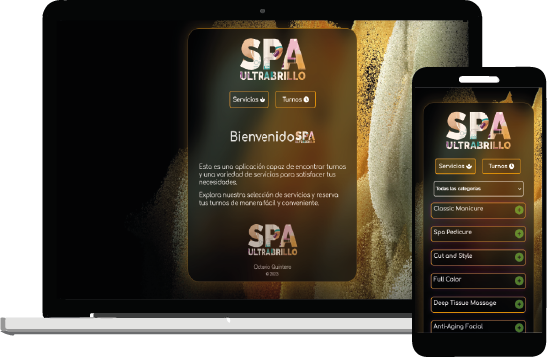

# Proyecto de Turnos

## Descripción
Este proyecto de turnos es una aplicación web diseñada para permitir a los usuarios reservar turnos para una variedad de servicios. La aplicación facilita la búsqueda y selección de servicios disponibles, la programación de citas y la confirmación de turnos.

## Características Principales
- **Selección de Servicios:** Los usuarios pueden explorar una lista de servicios disponibles y seleccionar aquellos que les interesen.
- **Programación de Citas:** Una vez seleccionado un servicio, los usuarios pueden elegir una fecha y hora convenientes para programar su cita.
- **Confirmación de Turnos:** Después de seleccionar la fecha y la hora, los usuarios pueden confirmar su turno para asegurar su reserva.
- **Visualización de Turnos Confirmados:** Los usuarios pueden ver una lista de sus turnos confirmados para mantener un registro de sus citas programadas.
- **Interfaz Responsiva:** La aplicación está diseñada para funcionar en una variedad de dispositivos, desde computadoras de escritorio hasta dispositivos móviles, garantizando una experiencia de usuario óptima en todos los tamaños de pantalla.

## Tecnologías Utilizadas
- **React:** El frontend de la aplicación está construido utilizando React, una biblioteca de JavaScript para construir interfaces de usuario.
- **React Router:** Se utiliza React Router para gestionar la navegación entre las diferentes páginas y componentes de la aplicación.
- **Redux:** Redux se utiliza para gestionar el estado de la aplicación y facilitar el manejo de los datos entre los diferentes componentes.
- **Material-UI:** Material-UI proporciona componentes de interfaz de usuario preestilizados que se utilizan para construir la interfaz de usuario de la aplicación.
- **SCSS:** Se utiliza SCSS (Sass) para escribir estilos CSS más estructurados y reutilizables.

## Ejecución del Proyecto
Para ejecutar el proyecto en un entorno local, sigue estos pasos:
1. Clona el repositorio desde [GitHub] https://github.com/octa-quintero/test-turnos a tu máquina local.
2. Abre una terminal y navega hasta el directorio del proyecto.
3. Ejecuta el comando `npm install` para instalar todas las dependencias del proyecto.
4. Una vez completada la instalación, ejecuta el comando `npm run dev` para iniciar la aplicación.
5. La aplicación se abrirá en tu navegador web predeterminado y podrás interactuar con ella.

¡Disfruta explorando y utilizando la aplicación de turnos!
